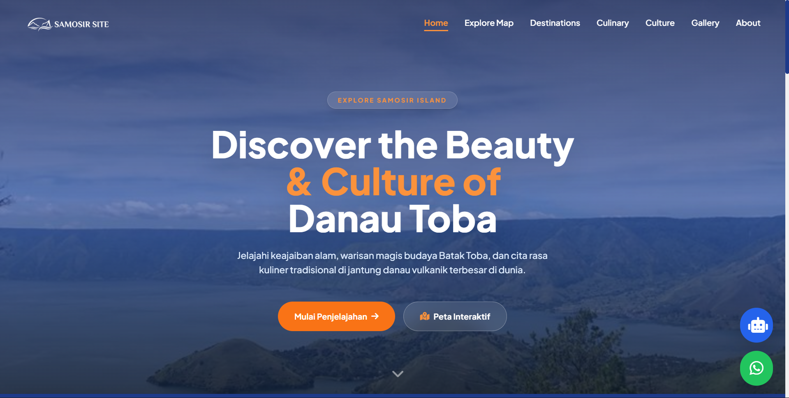
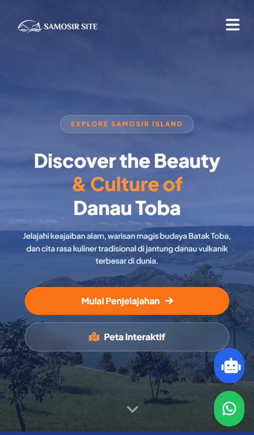

# Samosir | Portal Wisata Danau Toba (Web Design)
Proyek ini adalah desain *Front-End* untuk website portal pariwisata interaktif yang menampilkan keindahan alam, budaya, kuliner, dan destinasi wisata di Pulau Samosir dan kawasan Danau Toba.

## Live Demo
Website ini telah di-hosting menggunakan **GitHub Pages** karena aksesibilitasnya yang simpel, ringan, dan efisien.  
👉 **[Klik di sini untuk melihat Live Demo](https://kevin-baho.github.io/Cila-Team/index.html)**

## Cuplikan Layar (Screenshots)
**Tampilan Desktop / Laptop:**

**Tampilan Mobile / HP:**

## Fitur Utama
- **Desain Modern & Responsif:** Tampilan UI/UX yang dapat menyesuaikan dengan rapi di berbagai ukuran layar (HP, Tablet, maupun Laptop).
- **Scroll Animations:** Efek animasi mulus yang muncul saat layar di-scroll menggunakan library AOS (*Animate On Scroll*).
- **Interactive Floating Action:** Tersedia *Floating Button* di pojok layar yang berisi pintasan ke WhatsApp dan jendela purwarupa (UI) Chatbot.
- **Navigasi Lengkap:** Menu interaktif yang memudahkan pengunjung menjelajahi Peta, Destinasi, Kuliner, Galeri, dan Budaya Samosir.

## Teknologi yang Digunakan
Proyek ini dibangun murni menggunakan teknologi antarmuka web standar:
- **HTML5 & CSS3**
- **Tailwind CSS** (via CDN untuk *styling* cepat)
- **JavaScript (Vanilla)** (Untuk logika *toggle* menu dan interaksi *floating button*)
- **AOS Library** (Untuk animasi elemen)
- **FontAwesome** (Untuk aset ikon)
- **Google Fonts** (Menggunakan *font* Plus Jakarta Sans)

## Cara Menjalankan Project Secara Lokal
Jika Anda ingin menjalankan atau memodifikasi kode ini di komputer Anda, ikuti langkah berikut:
1. Unduh proyek ini dalam format ZIP (Klik tombol `Code` > `Download ZIP`).
2. Ekstrak file ZIP yang sudah diunduh ke dalam folder komputer Anda.
3. **Pastikan perangkat Anda terhubung ke internet** (Ini wajib, karena proyek ini memanggil CSS Tailwind, animasi, dan ikon secara *online* melalui CDN).
4. Buka folder hasil ekstraksi, lalu klik ganda (*double-click*) pada file `index.html` untuk membukanya di *browser* Anda.
5. *(Opsional)* Jika tidak ingin mengunduh file, Anda bisa langsung mengunjungi tautan **Live Demo** di atas.

## Catatan Penting (Disclaimer)
Proyek ini saat ini difokuskan pada **Desain Antarmuka (Front-End/UI)**. Oleh karena itu, beberapa fitur fungsional tingkat lanjut—seperti fitur pemrosesan pesan pada **Chatbot AI**—masih berupa tampilan visual (*mockup UI*) saja dan belum bisa membalas pesan secara nyata. 
Untuk mengaktifkan fitur *bot* tersebut sepenuhnya, diperlukan pengembangan sistem *Back-End*, logika algoritma, dan integrasi API (seperti OpenAI/Dialogflow) di tahap pengembangan selanjutnya.
Tetapi untuk fitur map interaktif, pencarian dan juga pengelompokan lokasi sudah bisa digunakan.

## Tim Pengembang
Desain dan kode ini dikembangkan oleh **CilaTeam** dan belum pernah dibuat ke lomba apapun:
- **Cindy** | WhatsApp: [+62 821-6190-6044](https://wa.me/6282161906044)
- **Risky** | WhatsApp: [+62 823-6143-9414](https://wa.me/6282361439414)